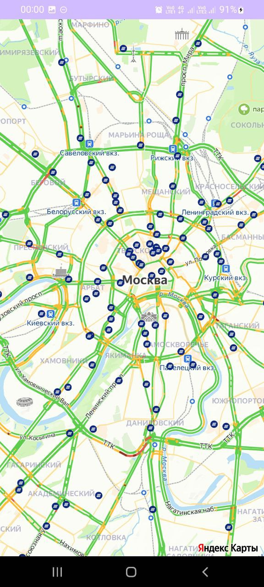

# Проект команды SEVER для участия в MORE.Tech 5.0
## Описание
VTB Bank App - это мобильное приложение, разработанное для удобного поиска и отображения на карте отделений банка VTB и банковских терминалов. Приложение позволяет пользователям найти ближайшие отделения и терминалы, отобразить их на карте и получить подробную информацию о каждом местоположении.
## Реализованный функционал
- Отображение отделений банка на карте
- Хранение данных о избранных отделениях и терминалах с использованием Room Persistence Library
- Интеграция с Yandex MapKit для отображения карты и местоположения
## Технические детали реализации
### Данные
- Данные хранятся в **БД SQLite (Room)**
- Подгружаются из json файла, находящегося в папке asset
## Используемые технологии
- Язык программирования: Kotlin
- Архитектурный паттерн: MVVM (Model-View-ViewModel)
- База данных: Room Persistence Library
- Карты и местоположение: Yandex MapKit
- Асинхронное программирование: Coroutines
## Скриншоты приложения

